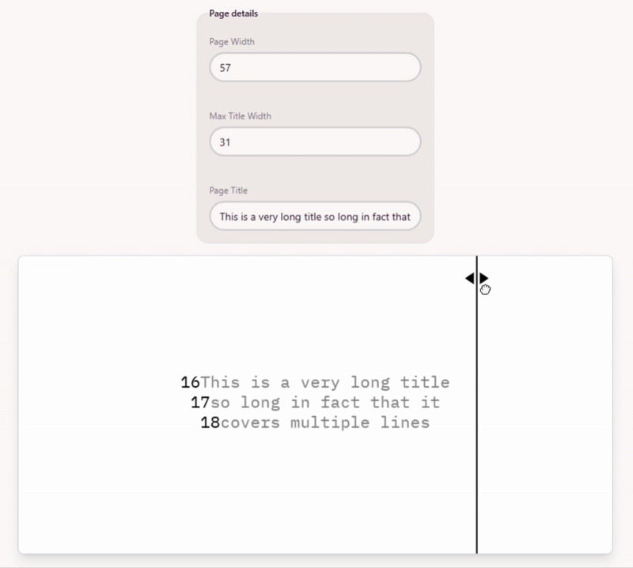
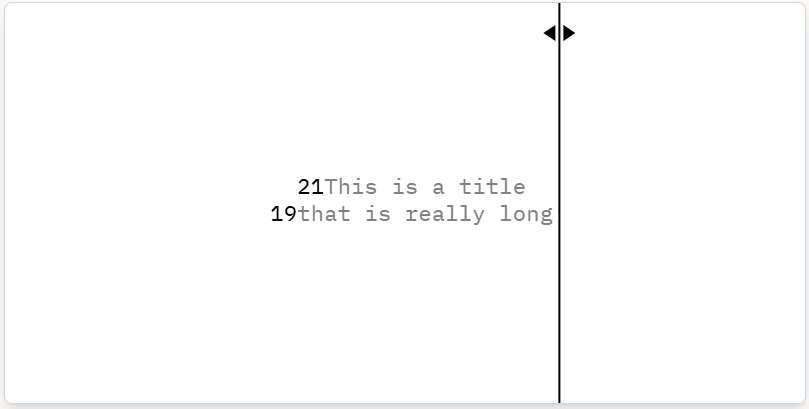

# A tool for centring titles on a typewriter

## The problem

I like to centre titles on a typewriter but it's often tricky, especially for longer titles. The method is this:

- Count the number of characters including spaces in the title
- Subtract from the number of characters on a line
- Divide by two
- Go to this position on the typewriter

This is fine and easy for short titles, but annoying when the title is long. What if it's long enough that you want to break it to multiple lines. Where do you break the text? What if you don't end up with a whole number of characters? Do you shift the title left or right? Is it possible to centre any title?

## The solution

See it [here](https://type.artomweb.com)

- The number at the beginning of each line is the number of spaces required to get to the first letter
- Numbers are red when the line requires a non-integer number of spaces, you can adjust the title width to find a solution with a whole number of spaces
- To adjust the title width you can enter it at the top or drag the margin line
- The page details are saved to local storage so you don't have to input the page width each time

## Thinking

If the page width is odd then you need an odd number of characters in each line to have a whole number of leading spaces.

Is it possible to centre every given title? Can you keep re-shuffling the lines until it has a whole number of leading spaces on every line?

Is there a closed form solution to checking if a title can be centred? If the line length has the same parity as the pageWidth.

### For centering on 57 (odd)

#### Example 1

Even (even)

#### Example 2

Deer roam over even turf.
Deer roam (odd)
over even turf (even)

## TODO

- Make the interface look like a type writer? At minimum a better form

