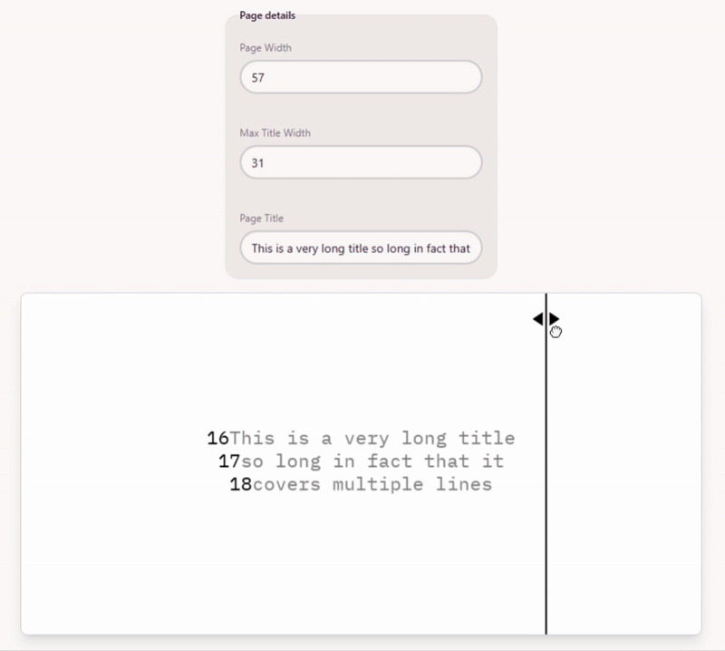

# A tool for centring titles on a typewriter

## The problem

I like to center titles on a typewriter but it's often tricky, especially for longer titles. The method is this:

- Count the number of characters including spaces in the title
- Subtract from the number of characters on a line
- Divide by two
- Go to this position on the typewriter

This is fine and easy for short titles, but annoying when the title is long. What if it's long enough that you want to break it to multiple lines. Where do you break the text? What if you don't end up with a whole number of characters? Do you shift the title left or right? Is it possible to center any title?

## The solution

